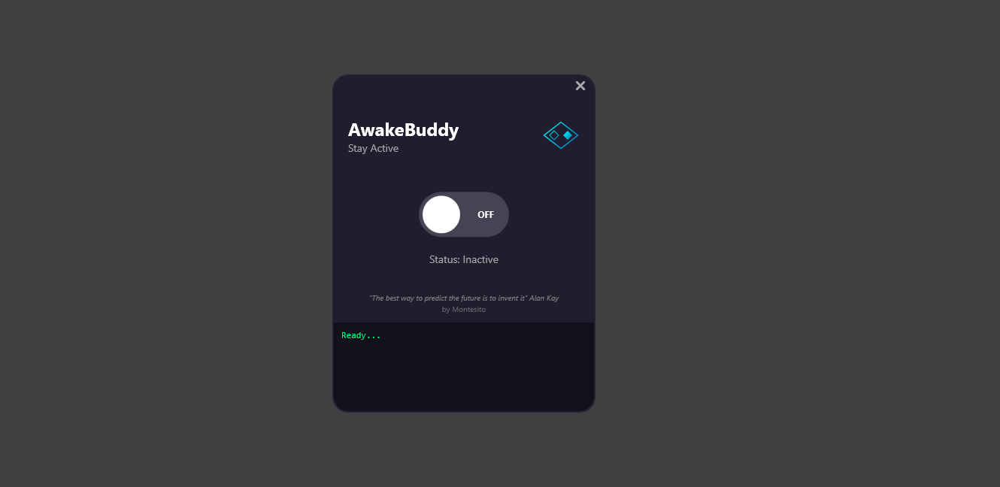
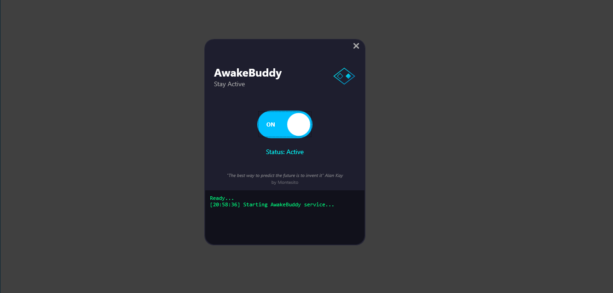

# AwakeBuddy

[](https://github.com/montesito/awake-buddy/releases)
[](https://github.com/montesito/awake-buddy/blob/main/LICENSE)
[](https://github.com/montesito/awake-buddy/stargazers)
[](https://github.com/montesito/awake-buddy/network)


**Version 1.0** | [🇪🇸 Leer en Español](README_SP.md)

> [!NOTE]
> This application is designed exclusively for **Windows environments**. It has been extensively tested on **Windows 11**.

*Prevent computer sleep modes with style.*

---

**A professional-grade utility designed to maintain system activity during critical workflows.**

AwakeBuddy leverages a **Native Windows Architecture**, built entirely on PowerShell and the Windows Presentation Foundation (WPF). This cleaner approach eliminates the need for heavy external frameworks (like Electron), resulting in an application that is:

- **Ultra-Lightweight**: Minimal memory and CPU footprint.
- **Dependency-Free**: Runs natively on any modern Windows 10/11 environment.
- **Secure**: Transparent source code with no hidden binaries.


*Figure 1: OFF The minimalist, dark-themed interface.*


*Figure 2: ON The minimalist, dark-themed interface.*


## Core Capabilities
*   **Intelligent State Maintenance**: Simulates `ScrollLock` input events to prevent operating system sleep timers without interfering with user workflow.
*   **Asynchronous Execution**: Core logic operates in an isolated CPU thread (Job), ensuring the UI remains perfectly responsive.
*   **Native WPF Interface**: A fully vector-based, high-DPI aware user interface that scales perfectly on any display.
*   **Pure PowerShell Core**: The entire application logic is open and inspectable, demonstrating the power of native Windows automation.

## Installation & Usage

### Option 1: Executable (Recommended)
**`AwakeBuddy.exe`**
- Custom Icon.
- Runs silently (no terminal window).

### Option 2: Launcher Script (Alternative)
**`Launch.vbs`**
- Runs the PowerShell script silently.
- Useful if you want to modify the source code.

### Option 3: Manual Startup
Run via PowerShell terminal:
```powershell
powershell -NoProfile -ExecutionPolicy Bypass -File .\AwakeBuddy.ps1
```

## Project Structure
The solution is modularized for maintainability:

*   **`AwakeBuddy.ps1`**: Bootstrapper and entry point.
*   **`Src/UI/`**: XAML definitions for `MainWindow` (Layout) and `Styles` (Theming).
*   **`Src/Logic/`**: Background job logic for activity simulation.
*   **`Assets/`**: Static resources.

## Development
This project uses a modular PowerShell + XAML structure.
- **Build**: No build required for scripts. To regenerate the executable wrapper, use the C# compiler (`csc.exe`).

## Download
**Get the latest version:**
[**Download AwakeBuddy.exe**](Bin/AwakeBuddy.exe)
*(This executable is located in the `Bin/` folder and runs the utility without installation.)*

> [!WARNING]
> **Download Security Alert**: Because this is an unsigned `.exe` file, your browser or Windows may flag it as "suspicious".
> **This is secure.** If you decide to download, please trust the file, follow the browser steps to "Keep" or "Run anyway", and **allow your antivirus to scan it** to verify its safety.

## Collaboration
**Love this tool?**
Contributions, issues, and feature requests are welcome! 
Feel free to check the [repository](https://github.com/montesito/awake-buddy) if you want to contribute.
*Give a ⭐️ if this project helped you!*

## License
**MIT License**
Copyright (c) 2025 Montesito.
Permission is hereby granted, free of charge, to any person obtaining a copy of this software and associated documentation files.
See the [LICENSE](LICENSE) file for full details.

## Safety & Disclaimer
**Built on Native Resources.**
This software is designed to be as safe and unobtrusive as possible. It relies entirely on native Windows protocols (PowerShell, .NET Framework) and contains **no external binaries, drivers, or hidden dependencies**. The source code is transparent and open for inspection.

**User Responsibility**
However, by using this software, you acknowledge that:
1.  Preventing sleep mode can deplete battery life rapidly on laptops.
2.  Preventing sleep while a device is in an enclosed space (like a bag) can cause overheating.
3.  **The Developer is NOT responsible** for any hardware damage, data loss, or other issues resulting from the use or misuse of this tool. Use strictly at your own discretion.

## Antivirus & Security
This application is built entirely with **Native Windows Resources** (PowerShell & .NET), making it transparent and secure.

**We encourage you to let your Antivirus scan the file.**
Because this tool is a custom, unsigned utility that simulates key presses, some security software may initially flag it as "Unknown".
1.  **Let it Scan**: Allow your Antivirus to perform a deep scan. It will verify that there is no malicious code.
2.  **Open Source**: You can review the full source code in this repository to see exactly how it works.
3.  **False Positives**: If a generic warning appears (common with new, unsigned software), you can proceed with confidence knowing the code is transparent.

---
© 2025 Montesito
